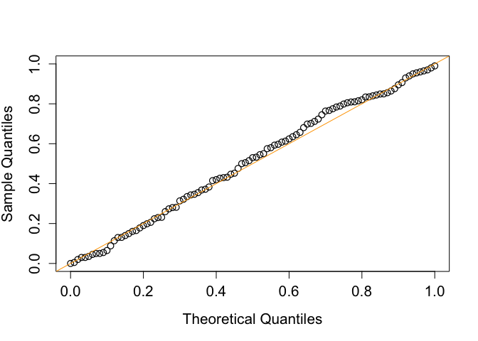

<!-- README.md is generated from README.Rmd. Please edit that file -->

# abmed

<!-- badges: start -->
<!-- badges: end -->

The goal of abmed is to assess whether and how a specific exposure
affects the outcome of interest through intermediate variables using
adaptive bootstrap. The adaptive method considers the composite
structure of no mediation effect, resulting in calibrated type I error
and improved statistical power. For more information, refer to He, Y.,
Song, P. X. K., and Xu, G. (2023), “Adaptive bootstrap tests for
composite null hypotheses in the mediation pathway analysis,” Journal of
the Royal Statistical Society Series B: Statistical Methodology,
qkad129. <https://doi.org/10.1093/jrsssb/qkad129>.

## Installation

You can install the R CRAN version of abmed like so:

``` r
install.packages("abmed")
```

and the development version of abmed like so:

``` r
# Install abmediation from GitHub:
devtools::install_github("canyi-chen/abmed")
```

## Example 1

This is a basic example which shows you how to apply the adaptive
bootstrap for testing no mediation effect under the classical linear
structral equation model:

### A single mediator

``` r
library(abmed)


## Set up parameters
alpha_S <- beta_M <- 1/6

set.seed(2)
data <- generate_all_data(
  n = 200,
  alpha_S = alpha_S,
  beta_M = beta_M
)
S <- data$S
M <- data$M
Y <- data$Y
X <- data$X

abYlm.Mlm(
  S,
  M,
  Y,
  X,
  B = 199
)
#> $mediation_effect
#> [1] 0.03081102
#> 
#> $p_value
#> [1] 0.01507538
#> 
#> attr(,"class")
#> [1] "abYlmMlmResult"
```

### Two mediators

``` r
library(abmed)


## Set up parameters
alpha_S <- beta_M <- rep(1/6, 2)

set.seed(2)
data <- generate_all_data(
  n = 200,
  alpha_S = alpha_S,
  beta_M = beta_M
)
S <- data$S
M <- data$M
Y <- data$Y
X <- data$X

abYlm.Mlm(
  S,
  M,
  Y,
  X,
  B = 199
)
#> $mediation_effect
#> [1] 0.03820384
#> 
#> $p_value
#> [1] 0.005025126
#> 
#> attr(,"class")
#> [1] "abYlmMlmResult"
```

## Example 2

This example shows the example for using abYlm.Mglm and how to setup
covariates_cfder that you would to condition on.

``` r
library(abmed)


## Set up parameters
M.family <- poisson()
alpha_S <- beta_M <- 1/15

set.seed(2)
data <- generate_all_data(
  n = 200,
  alpha_S = alpha_S,
  beta_M = beta_M,
  M.family = M.family
)
S <- data$S
M <- data$M
Y <- data$Y
X <- data$X

abYlm.Mglm(
  S,
  M,
  Y,
  X,
  M.family = M.family,
  B = 199
)
#> $mediation_effect
#> [1] 0.02642484
#> 
#> $p_value
#> [1] 0.01005025
#> 
#> attr(,"class")
#> [1] "abYlmMglmResult"

abYlm.Mglm(
  S,
  M,
  Y,
  X,
  covariates_cfder = colMeans(X), # the covariates_cfder that you would to condition on
  M.family = M.family,
  B = 199
)
#> $mediation_effect
#> [1] 0.03110028
#> 
#> $p_value
#> [1] 0.01005025
#> 
#> attr(,"class")
#> [1] "abYlmMglmResult"
```

## Example 3

This exmaple shows that the adaptive bootstrap can control the type I
error under the singular null hypothesis.

``` r
## Load libraries
library(abmed)

if (rlang::is_installed("future.apply")) {
  library(future.apply)
  plan(multisession, workers = 12)
} else {
  install.packages("future.apply")
  library(future.apply)
  plan(multisession, workers = 12)
}


## Set up parameters
M.family <- gaussian()
Y.family <- gaussian()

simulation <- function(alpha_S = 0, beta_M = 0) {
  data <- generate_all_data(
    n = 500,
    alpha_S = alpha_S,
    beta_M = beta_M,
    M.family = M.family,
    Y.family = Y.family
  )
  S <- data$S
  M <- data$M
  Y <- data$Y
  X <- data$X

  out <- abYlm.Mlm(
    S,
    M,
    Y,
    X,
    B = 199
  )
  out
}


## Empirical distribution of the p value
# the number of replication for approximating the distribution of the p value
Nreps <- 200
alpha_S <- beta_M <- 0
output <- future_replicate(Nreps, simulation(0, 0))


plot(
  seq(0, 1, 0.01),
  quantile(unlist(output[2,]), probs = seq(0, 1, 0.01)),
  pch = 1,
  cex = 1.2,
  cex.lab = 1.3,
  cex.axis = 1.3,
  ylab = "Sample Quantiles",
  xlab = "Theoretical Quantiles",
  type = "p",
  xlim = c(0, 1),
  ylim = c(0, 1),
  lwd = 1.2
)
abline(0, 1, col = "orange")
```


